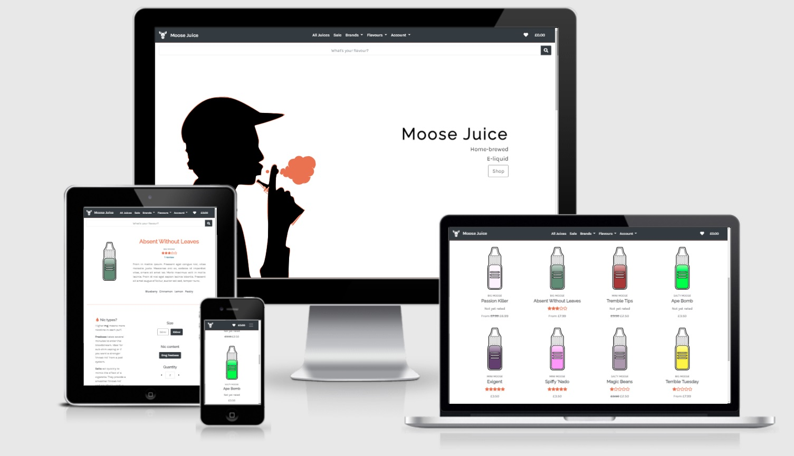
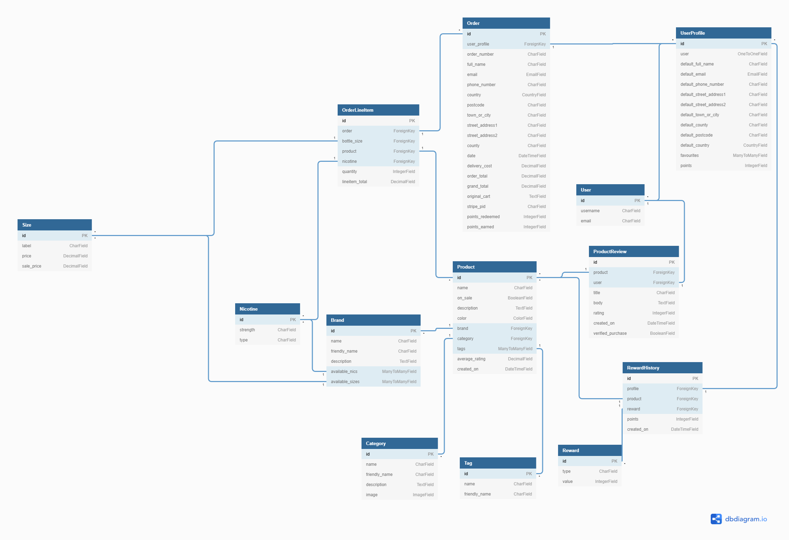

# Moose Juice


**[Live demo](https://moose-juice.herokuapp.com/)**
---
<span id="top"></span> 
## Index
- <a href="#context">Context</a>
- <a href="#ux">UX</a>
  - <a href="#ux-overview">Overview</a>
  - <a href="#ux-stories">User stories</a>
  - <a href="#ux-wireframes">Wireframes</a>
  - <a href="#ux-design">Design</a>
- <a href="#database-model">Database model</a>
- <a href="#features">Features</a>
  - <a href="#features-current">Current</a>
  - <a href="#features-future">Future</a>
- <a href="#technologies">Technologies Used</a>
- <a href="#testing">Testing</a>
- <a href="#deployment">Deployment</a>
- <a href="#credits">Credits</a>
---
<span id="context"></span>

## Context
Smoking will kill you. Anyone who smokes should explore vaping as an enjoyable means to kick the habit. The only risk is taking up a different, albeit much safter habit.

Vaping has become mainstream. The userbase is broad and has varied wants and expectations, from the older generation looking to quit the habit, to the hobbyists spending vast sums on their hardware. There are many online vaping stores out there, but they tend to be busy and bloated, selling anything you might ever need but with little style. The simplest and most crucial part of the industry is the e-liquid itself, and that's where Moose Juice comes in.

<div align="right"><a style="text-align:right" href="#top">Go to index :arrow_double_up:</a></div>

<span id="ux"></span>

## UX

<span id="ux-overview"></span>

### Overview
Unconcerned with selling hardware in its myriad forms, Moose Juice is focused on providing nothing but high quality, home-brewed e-liquid and delivering a great user experience. With an aesthetic not typically seen in larger vaping e-commerce stores and an accessible rewards system, the company hopes to retain and grow its clientele, guided by their feedback. The target audience is 25 - 40-yr-old smokers and existing vapers looking for a dedicated juice supplier. Converting a sale will rely on quickly signposting potential customers to relevant products and then giving them options.

The two questions asked by the site are "What's your flavour?" and "How do you vape?"

#### Flavours
Flavour and choice are paramount at Moose Juice. That's what will keep people off cigarettes for good. Options to filter by common vaping flavour profiles (bakery, dessert, fruit etc) are complimented by the ability to search for individual flavour notes (cinnamon, cream, apple etc). When browsing for a new juice to try, most users will go straight for an individual flavour and then make a choice based on its popularity.

#### Brands
As far as e-liquid goes, all vapers will fall into one of three categories. Moose Juice has a brand for each category:

**Big Moose**

For use in 'sub-ohm' devices, which need a lot of juice to produce those thick clouds. This type of e-liquid has a thicker consistency and as it's used up quickly needs to come in larger bottles. Due to the TPD Regulations it cannot be sold pre-mixed with nicotine.

**Mini Moose**

One of two Moose Juice brands aimed at users of discreet 'pod' systems. These thinner juices come in a variety of pre-mixed freebase nicotine strengths and to comply with TPD Regulations must not be sold in bottles larger than 10ml.

**Salty Moose**

These pre-mixed juices use nicotine salts rather than freebase, providing a much quicker absorbtion rate akin to that of traditional cigarettes and a smoother 'throat hit' on the inhale.

The way each brand of e-liquid is made means that certain flavour combinations are better suited to one over another. Moose Juice's expertise in understanding these differences is what makes them so good. A particular mix of flavours will only appear in one brand.

<span id="ux-stories"></span>

### User stories

#### Overarching user expectations
- Consistent
- Easy to navigate
- Intuitive
- Responsive
- Secure
- Visually pleasing

|**As a...**|**I want to...**|**So I can...**|
|:-----|:-----|:-----|
|Potential customer|Immediately understand the purpose of the site|Decide whether to stay|
||Easily browse through juices|Learn how much they cost and how others have rated them|
||Create an account easily|Purchase products|
||Add items to my shopping cart before registering|Avoiding registering if not necessary|
||Learn about a specific juice's flavour profile|Make an informed purchase decision|
||Search by juice name and flavour|Find specific products|
||Filter by broad flavour profiles|Find juices matching my taste|
||Filter by individual flavours|Quickly find the flavours I like|
||Read reviews/ratings for juices|Making informed purchase decisions|
||Learn about any rewards system|Register with confidence|
||Choose bottle size and nicotine content|Customise purchases to my preference|
|Registered user|Save my default delivery details|Proceed to checkout more quickly in future|
||Add a juice to my favourites list|Quickly find a product I'd like to purchase again|
||View my previous purchases|Make repeat orders|
||Leave a review and rating for juices|Inform others about good/bad juices|
||Know that a review has come from a verified purchase|Make informed purchase decisions|
||Review my basket prior to checkout|Remove/adjust quantities|
||Receive confirmation of my orders|Have proof of purchase|
||See what juices are on sale|Find the best value for money|
||Receive free delivery above an order threshold|Feel rewarded for larger purchases|
||Receive reward points|Get discounts on future purchases and feel rewarded for my loyalty|
||View my reward points|See what I can redeem on future purchases|
|Site owner|View, add, edit and delete products|Keep the product list up to date|
||Have a flexible reward system|Entice new customers and reward existing members|
||Have a simple payment structure|Easily make price changes for all products|


<span id="ux-wireframes"></span>

### Wireframes
Wireframes created at the start of the project for **mobile** and **desktop** can be accessed [here](wireframes/).

There were some noteworthy deviations from the plan. These were:
1. Not including a blog app due to time constraints. This would be relatively simple to implement
2. Not including a suggestion for similar products, again due to time constraints. This could be expanded to include an algorithm to suggest products based on order history or current browsing habits
3. Not including a bespoke login page as the allauth template was adequate
4. Not including breadcrumbs due to unexpected complexity and insufficient time
5. Not including pagination due to lack of time

<span id="ux-design"></span>

### Design choices
Bootstrap provides a flexible framework for building upon and wherever possible its structure has been used and modified to achieve the desired functionality and feel.

#### Core colour scheme
The colour scheme is based on the orange colour of a traditional cigarette's filter in order to inspire familiarity in potential customers who may look to vaping on their road to quitting smoking. 

The 'filter-tip' orange is consistently used as an accent colour against Bootstrap's cool `dark` tones, along with judicious white space.

-  #343a40
-  #ff7f54 (for dark backgrounds)
-  #e4714b (for light backgrounds)
-  #3c7c9a (for regular links)

The aim was to provide a solid colour base which could bring the other elements on the site to life, most notably the multi-coloured juice bottles.

Other splashes of colour are used to highlight important information, such as the pill to show a discount has been applied on an otherwise two-tone page (Boostrap's `warning`), and a familiar but not typical blue for regular links.

#### SVGs

In the planning stages the project was going to use images of existing vape products. However, in order to provide a different overall aesthetic (and in part due to the challenge of sourcing relevant data and images) the decision was made to use an inline SVG which could be varied per product. The result is a broad spectrum of colours which work well to punctuate the otherwise restricted colour palette. 

#### Buttons, Tabs, Pills

The same colours are used as for the core site elements, with variations depending on the action. Affirmative actions (choose, confirm, submit, delete) have a solid dark background with orange hover effects whereas negative actions (back, cancel etc) are indicated an outline which is filled dark on hover. 

#### Hero image

Another SVG has been used for the hero image to compliment the juice bottles. It has been edited to match the site's core colours and a subtle blurring effect applied to evoke clouds of vapor clearing from the silhouette.

#### Icons

Simple icons are used with variations on the core colour scheme. Orange hover effects are used for user feedback, as are Font Awesome `fas` and `far` icons to indicate whether a product is a user favourite or not. On the favourites page itself, `broken-heart` is used to indicate that the product has been removed from favourites. Icons are also used to give context to buttons during the checkout process (`piggy-bank`, `lock`, `times`), some information about nicotine on the product details page, and for the `star` icon on ratings.

#### Shadows
In order to highlight particular areas of interest to the user, some subtle shadowing is used when products are hovered (larger screens only) and also for modals, toasts, product reviews and the add/edit product page (larger screens only). Used sparingly, these effects have impact on an otherwise flat canvas.

#### Fonts

[Raleway](https://fonts.google.com/specimen/Raleway#about) - A hard, slender font used for all the site's headers.

[Karla](https://fonts.google.com/specimen/Karla#about) - A softer font used for everything other than headings. It compliments the rounded edges of the other elements on the site.

#### Bootstrap

The following Bootstrap components have been used:

- [Buttons](https://getbootstrap.com/docs/4.6/components/buttons/)
- [Cards](https://getbootstrap.com/docs/4.6/components/card/)
- [Forms](https://getbootstrap.com/docs/4.6/components/forms/)
- [Modals](https://getbootstrap.com/docs/4.6/components/modal/)
- [Navs](https://getbootstrap.com/docs/4.6/components/navs/)
- [Navbar](https://getbootstrap.com/docs/4.6/components/navbar/)
- [Toasts](https://getbootstrap.com/docs/4.6/components/toasts/)

<div align="right"><a style="text-align:right" href="#top">Go to index :arrow_double_up:</a></div>

<span id="database-model"></span>

### Database model

A relational database is best suited to this type of project given the number of relationships between the tables. SQLite was used during development and then Heroku Postgres in production. The diagram below may help to visualise the database:



#### Key models

**Brand**
- This model is important in determining the options available when selling Products.
- While a more complex model using product variants, options and variant options has its merits, for the purposes of this project where only one factor (bottle size) determines the price for a whole range of related products, it did not feel appropriate
- Brand includes two many-to-many fields distinguishing between available nicotines and bottle sizes, and this could have been combined into a single 'options' relationship but to preserve some relational integrity it was decided to split them. As a result there are separate tables for Size and Nicotine

**Product**
- Holds canonical information about the various juices (name, description, colour, creation date)
- The price is not stored here as it is only dictated by the volume of liquid it is purchased in. See the Size model for more details
- While the price is not attached, the admin still has control over its pricing as they can choose whether or not a juice is on sale
- The product's average rating is also stored here to make work in the Views simpler. It is updated by a `post_save` signal from the ProductReview
- The foreign key to Brand is particularly important as it governs what options are available to each Product instance, and in turn the pricing options
- The relationship to Category is merely descriptive
- A many to many relationship with Tag (ie individual flavours) allows multiple flavours to be added to multiple products
- One significant downside to removing key information from the Product model was that at each stage of the transactional journey, three models were required to provide necessary data to the Views. Rather than just havng a simple Product instance, both a Size and Nicotine intance were also required. The downside to consolidating all of this information into a 'product variant' model would be the potentially very large number of database entries for a single juice product. In its current state this is not an issue at all

**Size**
- It may not be ideal to have price stored in a table which is not an intuitive fit, but for this database it makes sense to keep it there because it fits the business model more naturally.
- Queries to determine a product's price are quite long-winded as a result, but the expected functionality was achieved
- Due to including the price here, it also makes sense to attach the sale price with it. By adding an `on_sale` Boolean to the Product model this became less problematic

**Nicotine**
- As with Size, the Nicotine model is needed to keep relevant information about the product options chosen by a user
- With more time this model could have been extended to provide more information about the various types of nicotine

**OrderLineItem**
- As mentioned above, this model requires three instances rather than a single 'product' instance to store the necessary information

**Order**
- In addition to storing typical information about an order such as the user, order number, delivery details and total cost, this model also stores information about the points earned and redeemed by a Registered User.
- A signal is fired to update the number of points earned once an Order is completed

**UserProfile**
- Created on registration for each user, this holds typical information that can be used to speed checkout for the user
- Also stores the user's list of favourites via a many to many relationship with Product, and the number of points they currently have in the bank


**ProductReview**
- Ties reviews to a user and product by foreign key, allowing checks as to whether a user has previously purchased a product before sending a signal to award them points
- In hindsight this should have been related to UserProfile to allow for simpler queries about user activity and engagement

**RewardHistory**
- Keeps track of the rewards for purchases and review, and also when points have been spent on a discount
- The value of rewards is stored in a separate Reward database with the expectation that different rewards may be introduced


<div align="right"><a style="text-align:right" href="#top">Go to index :arrow_double_up:</a></div>

<span id="features"></span>

## Features
<span id="features-current"></span>

### Current

#### Site-wide

**Favourites**

- Users can easily save their favourite juices from any of the product pages, and remove from favourites just as easily.
- A heart icon shows whether or not a product is a user favourite (full vs empty). When clicked an ajax request updates the database without reloading the page, providing a more seamless user experience.

**Rewards**

- Points are rewarded for various user actions:
  - Registering (100 points)
  - Leaving a review following a verified purchase (5 points)
  - For every £1 spent (1 point)
- They can be redeemed for a discount of 1 penny per point until the order total is zero.
- Points earned for purchases are calculated on the order total after an existing discount has been applied, and before the delivery cost is added on.
- Users can track how they have earned and spent points via their Account Dashboard.

**Responsive**

Effort has been made to ensure the website displays well across all devices, using Bootstrap's grid system and various media queries. Extra care was taken to handle the potentially long list of purchases and rewards in the Account Dashboard by limiting the height of the tab and styling it with `overflow-y: auto`.

**Accessible**

Colours have been adjusted using Chrome's suggestions about visibility improvements. Similarly, aria-labels have been used consistently to improve the experience of all potential vapers.

**Navbar**

Consistent on all pages, the navbar provides quick access to all areas of the site.

**Search bar**

The search bar finds juices matching a user's query either by name or from their constituent flavours. If a user knows what they want, this is their route to finding it. The user's search term is displayed once submitted.

**Toasts**

These pop-ups give context to and confirmation of user actions, including error messages, login/out, and success on leaving a review or on checkout. Where appropriate they also show a summarised copy of the shopping cart with a link to review before heading to checkout.

#### Page-specific

**Home**

- Striking hero image draws potential customers in and a simple call to action links straight to the juice products page.
- Trio of action cards invite further exploration of the home page (the brands and flavour categories) and a link to sign up to start receiving rewards.
- Brand section establishes how Moose Juice has separated its product range, gives details about each brand and a link to the respective juices.
- Flavour categories need no more explanation than a bold thumbnail icon which will filter the juices accordingly.

**Products**

- Sort field to order filtered juices by new arrivals, rating or name. The number of matching juices is displayed.
- Product cards show the essential details (name, category, rating and price), with a satisfying box-shadow hover effect.
- SVG used to depict each card, with an endless possibility of colours as chosen by the admin.
- Product rating is shown depicted as a set of stars.
- Product RRP is visible and if on sale this is struck out and replaced by the sale price.

  *Registered users*
- Can add/remove favourites by clicking the heart icon.

  *Super users*
- Those with admin rights get an extra icon which links to the edit product page.

**Product details**

- In addition to the information and functionality of the products page, a product description and list of individual flavour notes is included.
- Flavours link to all other products with the same flavour.
- A form allows users to pick options for the product, as well as the quantity, before submitting and adding the item to their cart.
- Only options available for the brand in question are available.
- Product reviews can be found under the form, including the star rating and whether the review is following a verified purchase.

  *Registered users*
- Have the ability to leave and edit reviews, but not to delete them.

  *Super users*
- Can both edit and delete a juice from the product detail page.
- Can edit and delete any user's review.

**Cart**

- Allows line item quantities to be altered or removed from the cart and updates on each change.
- Shows cart total, delivery and grand total of the order, as well as how many points they would earn if they were registered.
- If cart total is less than free delivery threshold, amount required to receive free delivery is shown.
- Protection in case an item in the cart has been deleted from the database, in which case the item will not be added and a message alerting the user will be displayed.

  *Registered users*
- Can see how many points they have available and can choose to redeem them on this order.
- If discount applied, the total updates accordingly to show discounted price and option to remove discount is offered.

**Checkout**

- Shows order summary and form to input delivery details.
- Payment handled by Stripe and reliability improved by use of webhooks.

  *Registered users*
- If delivery details previously saved, form will be pre-populated with them.
- Option to save delivery details for future purchases.
- If discount applied on the cart page, this is shown along with points redeemed.

**Checkout success**

Shows a summary of the order identifier, contact info and delivery information provided, as well as details of the order itself. On checkout the user is sent a confirmation email with details about their order.

**Account dashboard**

  *Registered users*
- Shows how many points a user has on their profile, with other information split into three sections:
- Details:
  - default contact and delivery info
  - ability to update to make future checkouts quicker
- Orders:
  - view previous orders using same template as checkout success page
  - extra option of repeating the order
  - repeating an order will repopulate the cart with previous order items
- Points:
  - summary of when and how points have been earned (account creation, purchases and reviews for verified purchases)
  - for reviews, includes a link to the product reviewed

**Add/edit product**

  *Super users*
- Can add/edit a juice, chosing all of its required features
- Can choose whether or not the juice is on sale
- A mockup of the juice as a product card is displayed, the name and colour of which are updated in real time to give a sense of how it will look when in the store
- On submitting the addition/change, super user is sent to the update product's details page

**Secure accounts**
Account security is covered by Django's allauth.

**CRUD functionality**

All users can:
- Read all products

Registered users can:
- Create product reviews
- Update product reviews
- Update their delivery details
- Update their list of favourites

Superusers can:
- Frontend:
  - Create, Update and Delete products
  - Create, Update and Delete any product reviews

**Static and image file hosting**

Static and image files are served from an Amazon S3 Bucket.

**Confirm delete**
When users request to delete a product or review, a modal pops up to confirm they wish to do so to prevent accidental deletion.

**Access protection**

Routes are protected using Django's `@login_required` route decorators to ensure non-super-users cannot interfere with the database.

**404 and 500 error handling**
Pages for 404 and 500 errors keep the user on the site when something goes wrong, allowing them to return to the content with minimal disruption.

<span id="features-future"></span>

### Future
- Blog app to display industry and Moose Juice news, including comments feature to engage with the community and gather more feedback
- Pagination and advanced search features to handle an increasing product list
- Site-wide use of ajax requests to reduce number of page reloads
- A 'suggested juices' section to encourage users to explore additional purchases
- Apple / Google pay to improve checkout experience
- Contact Us for improved correspondance with users
- About Us page to give insight into Moose Juice's origins and methods for creating their juices
- 'Learning Zone' to educate potential customers about the benefits of vaping and to dispell some of the myths surrounding it

<div align="right"><a style="text-align:right" href="#top">Go to index :arrow_double_up:</a></div>

<span id="technologies"></span>

## Technologies Used

### Languages
- [CSS](https://developer.mozilla.org/en-US/docs/Web/CSS)
- [HTML](https://developer.mozilla.org/en-US/docs/Web/HTML)
- [Javascript](https://developer.mozilla.org/en-US/docs/Web/JavaScript)
- [Python](https://www.python.org/)

### Frameworks
- [Bootstrap](https://getbootstrap.com/)
- [Django](https://www.djangoproject.com/)
- [jQuery](https://jquery.com/)

### Database
- [Heroku Postgres](https://www.heroku.com/postgres)

### Extensions and kits
- [Boto3](https://boto3.amazonaws.com/v1/documentation/api/latest/index.html)
- [django-colorfield](https://pypi.org/project/django-colorfield/)
- [jscolor](https://jscolor.com/)
- [Pillow](https://pillow.readthedocs.io/en/stable/)
- [Stripe](https://stripe.com/docs)

### Project management
- [Amazon AWS](https://aws.amazon.com/) (S3)
- [Balsamiq](https://balsamiq.com/wireframes/)
- [GitHub](https://github.com/)
- [GitPod](https://gitpod.io/)

### Tools
- [Am I Responsive?](http://ami.responsivedesign.is/)
- [Autoprefixer](https://autoprefixer.github.io/)
- [DB Diagram](https://dbdiagram.io/)
- [Favicon.io](https://favicon.io//)
- [Font Awesome](https://fontawesome.com/)
- [Google Fonts](https://fonts.google.com/)

<div align="right"><a style="text-align:right" href="#top">Go to index :arrow_double_up:</a></div>

<span id="deployment"></span>

## Deployment
The master branch of this repository is the most current version and has been used for the deployed version of the site. Separate branches were used for implementing features and fixes including colours, favourites, discounts, points, ratings, Stripe and SVGs.

### Prerequisites
[Python 3](https://www.python.org/downloads/) - core code

[PIP](https://pypi.org/project/pip/) - package installation

[Git](https://git-scm.com/) - version control

[Amazon AWS S3 Bucket](https://aws.amazon.com/) - host the site's static and media files

***Values for the env.py environment variables and Heroku Cvars used in the sections below will be unique to each SQLlite, Postgres and S3 Bucket created. Please refer to their respective documentation for further details.***

<details>
<summary>How to clone Moose Juice and run locally</summary>
<p>

To clone this project from its [GitHub repository](https://github.com/Edb83/moose-juice):
1. From the repository, click **Code**
2. In the **Clone >> HTTPS** section, copy the clone URL for the repository
3. In your local IDE open Git Bash
4. Change the current working directory to the location where you want the cloned directory to be made
5. Type `git clone`, and then paste the URL you copied in Step 2
```console
git clone https://github.com/Edb83/moose-juice.git
```
6. Press Enter. Your local clone will be created
7. Create a file called `env.py` to hold your app's environment variables, which should contain the following:

```console
import os

os.environ.setdefault("SECRET_KEY", "<app secret key of your choice>")
os.environ.setdefault("DEVELOPMENT", "True")
os.environ.setdefault('STRIPE_PUBLIC_KEY', '<key generated by Stripe>')
os.environ.setdefault('STRIPE_SECRET_KEY', '<key generated by Stripe>')
os.environ.setdefault('STRIPE_WH_SECRET', '<key generated by Stripe for individual webhook endpoint>')
```
To find your Stripe keys, login to Stripe and then under the **Developers** tab look for the 'Publishable Key' and 'Secret Key'

The webhook secret key can be found under **Webhooks** once you have created an endpoint, which should be set to receive all events and match this url structure:
```
<your site's base url>/checkout/wh/
```
You will need a different endpoint for the local version and deployed site, updating the `STRIPE_WH_SECRET` accordingly in their respective environment variables.

8. **Make sure the following are listed in your .gitignore file to prevent any environment variables being pushed publicly:**
```
core.Microsoft*
core.mongo*
core.python*
env.py
__pycache__/
*.py[cod]
*.sqlite3
*.pyc
node_modules/
db.json
```
9. Install the app requirements using:
```
pip3 install requirements.txt
```
10. Apply database migrations using:
```
python manage.py migrate
```
11. Create a new superuser and fill in your details:
```
python manage.py createsuperuser
```
12. The app can now be run locally using
```
python manage.py runserver
```
</details>

<p>

<details>
<summary>How to deploy to Heroku</summary>
<p>

To deploy the app to Heroku from its [GitHub repository](https://github.com/Edb83/moose-juice), the following steps were taken:
<!-- 1. **Commit** and **Push** the files to GitHub -->
2. **Log In** to [Heroku](https://id.heroku.com/login)
3. Select **Create new app** from the dropdown in the Heroku dashboard
4. Choose a unique name ('moose-juice') for the app and the location nearest to you
5. Under **Resources** search for and add **Heroku Postgres** to your app
6. In your CLI install **dj_database_url** and **psycopg2** so that you can use Postgres on your deployed site
```
pip3 install dj_database_url
pip3 install psycopg2
```
7. Log into Heroku via the CLI
```
heroku login -i
```
8. Migrate the database into Postgres
```
heroku run python manage.py migrate
```
9. Create a new superuser and fill in your details:
```
python manage.py createsuperuser
```
10. Install gunicorn
```
pip3 install gunicorn
```
11. Freeze the app's requirements
```
pip3 freeze > requirements.txt
```
11. Create a file called **Procfile** and include the following, making sure not to leave a blank line after it:
```
web: gunicorn moose_juice.wsgi:application
```
12. Disable Heroku's static file collection (temporarily)
```
heroku config:set DISABLE_COLLECTSTATIC=1 --app moose-juice
```
13. Add the hostname of your Heroku app to settings.py
```
ALLOWED_HOSTS = ['moose-juice.herokuapp.com', 'localhost']
```
14. Back in Heroku, select the **Deploy** tab and under **Deployment method** choose GitHub
15. In **Connect to GitHub** enter your GitHub repository details and once found, click **Connect**
16. Go to the **Settings** tab and under **Config Vars** choose **Reveal Config Vars**
17. Enter the following keys and values, some of which will different from those in your env.py:

|**Key**|**Value**|
|:-----|:-----|
|AWS_ACCESS_KEY_ID|`<your variable here>`|
|AWS_SECRET_ACCESS_KEY|`<your variable here>`|
|DATABASE_URL|`<added by Heroku when Postgres installed>`|
|DISABLE_COLLECTSTATIC|`1` NB this variable will be deleted later|
|EMAIL_HOST_PASS|`<your variable here>`|
|EMAIL_HOST_USER|`<your variable here>`|
|SECRET_KEY|`<your variable here>`|
|STRIPE_PUBLIC_KEY|`<your variable here>`|
|STRIPE_SECRET_KEY|`<your variable here>`|
|STRIPE_WH_SECRET|`<different from env.py>`|
|USE_AWS|True|

18. Go back to the **Deploy** tab and under **Automatic deploys** choose **Enable Automatic Deploys**
19. Back in your GitPod CLI add, commit and push your changes and Heroku will automatically deploy your app
```
git add .
git commit -m "Initial commit"
git push
```
20. Your deployed site can be launched by clicking **Open App** from its page within Heroku.

</details>

<p>

<details>
<summary>Setting up an S3 Bucket</summary>
<p>

1. Create an [Amazon AWS](aws.amazon.com) account
2. Search for **S3** and create a new bucket
- Allow public access
- Acknowledge
3. Under **Properties > Static** website hosting
- Enable
- Index.html as index document
- Save
4. Under **Permissions > CORS** use:
```
		[
  {
      "AllowedHeaders": [
          "Authorization"
      ],
      "AllowedMethods": [
          "GET"
      ],
      "AllowedOrigins": [
          "*"
      ],
      "ExposeHeaders": []
  }
]
```
5. Under **Permissions > Bucket Policy**:
- Generate Bucket Policy and take note of **Bucket ARN**
- Chose **S3 Bucket Policy** as Type of Policy
- For **Principal**, enter `*`
- Enter **ARN** noted above
- **Add Statement**
- **Generate Policy**
- Copy **Policy JSON Document**
- Paste policy into **Edit Bucket policy** on the previous tab
- Save changes

6. Under **Access Control List (ACL)**:
- For **Everyone (public access)**, tick **List**
- Accept that everyone in the world may access the Bucket
- Save changes

</details>
<p>
<details>
<summary>Setting up AWS IAM (Identity and Access Management)</summary>
<p>

1. From the **IAM dashboard** within AWS, select **User Groups**:
- Create new group e.g. `manage-moose-juice`
- Click through without adding a policy
- **Create Group**
2. Select **Policies**:
- Create policy
- Under **JSON** tab, click **Import managed policy**
- Choose **AmazongS3FullAccess**
- Edit the resource to include the **Bucket ARN** noted earlier when creating the Bucket Policy:
```
			"Resource": [
			                "arn:aws:s3:::moose-juice",
			                "arn:aws:s3:::moose-juice/*"
            ]
```
- Click **next step** and go to **Review policy**
- Give the policy a name e.g. `moose-juice-policy` and description
- **Create policy**
3. Go back to **User Groups** and choose the group created earlier
- Under **Permissions > Add permissions**, choose **Attach Policies** and select the one just created
- **Add permissions**
4. Under **Users**:
- Choose a user name e.g. `moose-juice-staticfiles-user`
- Select **Programmatic access** as the **Access type**
- Click Next
- Add the user to the Group just created
- Click Next and **Create User**
5. **Download the `.csv` containing the access key and secret access key. This will NOT be available to download again**

</details>
<p>
<details>
<summary>Hooking Django up to S3</summary>
<p>

1. Install boto3 and django-storages
```
pip3 install boto3
pip3 install django-storages
pip3 freeze > requirements.txt
```
2. Add the values from the `.csv` you downloaded to your Heroku Cvars under Settings:
```
AWS_ACCESS_KEY_ID
AWS_SECRET_ACCESS_KEY
```
3. Delete the `DISABLE_COLLECTSTATIC` variable from your Cvars and deploy your Heroku app
4. With your S3 bucket now set up, you can create a new folder called `media` (at the same level as the newly added `static` folder) and upload any required media files to it, making sure they are publicly accessible under **Permissions**

</details>

<div align="right"><a style="text-align:right" href="#top">Go to index :arrow_double_up:</a></div>
<span id="testing"></span>

## Testing
Full details of testing can be found [here](TESTING.md).

<div align="right"><a style="text-align:right" href="#top">Go to index :arrow_double_up:</a></div>

<span id="credits"></span>

## Credits

### Tutorials / Resources
- [Django docs](https://docs.djangoproject.com/en/3.2/)
- [How to work with AJAX requests with Django](https://simpleisbetterthancomplex.com/tutorial/2016/08/29/how-to-work-with-ajax-request-with-django.html)


### Student projects
- [LigaMoon's Prickly](https://github.com/LigaMoon/Prickly)

### Code modified from other sources
- [Star rating implementation](https://github.com/LigaMoon/Prickly/blob/main/products/static/products/js/product_item.js)

### Content
- All text is original
- Hero image from [Pixabay](https://pixabay.com/vectors/vaping-cigarette-electronic-3630389/)
- Icons from [Flaticon](https://www.flaticon.com/)
- Vape vector from [Vecteezy](https://www.vecteezy.com/free-vector/vape)

### Acknowledgements
- Brian Macharia, my mentor for MS4, for getitng me over the finish line
- Chris Zielinkski for his generous support with all things Django
- Gwen Bradbury for her help and support during our shared misery
- Jonathan Munz, my first mentor, for getting me this far
- Sean Young for his commitment to helping others and general coding savantism

### Disclaimer
This site was developed for educational purposes.
<div align="right"><a style="text-align:right" href="#top">Go to index :arrow_double_up:</a></div>
