

Back to [README](README.md)

## Index

- <a href="#user-stories">User stories - how are they met?</a>
- <a href="#testing-manual">Manual</a>
- <a href="#testing-auto">Automated</a>
- <a href="#testing-responsive">Responsiveness</a>
- <a href="#testing-resolved">Resolved issues</a>
- <a href="#testing-unresolved">Unresolved issues</a>

---

## User stories - how are they met?

### Overarching user expectations

**Consistency**

The site has been designed to be as consistent as possible, no matter the content:
- The Navbar and Footer remain the same across all pages, including Error pages.
- Headings and icons (form fields and add/edit/delete buttons) are standardised across all pages.
- Cards are a uniform shape and size per page and will never spill into a subsequent row.

**Easy navigation**

The likely options a user might need at a given moment have been carefully considered to ensure a smooth browsing experience:

- Headings are descriptive of the content displayed.
- When a search finds no results this is indicated with a link to get back to the action.
- The title of each page updates in the browser window to indicate where the user is.
- Hover effects provide feedback on larger displays.
- The footer contains is reserved for social media links.

**Intuitive design**

- Familiar icons have been used across the site for commonly expected actions e.g. heart, lock, shopping-cart, user, trash.
- Toasts pop-ups discretely alert the user when they perform meaningful actions i.e. logins, errors, successes.
- As a user might expect, modals appear to confirm content deletion.

**Responsiveness**

- Pages adapt to a variety of screen sizes thanks to the Bootstrap grid template and extensive testing in Chrome Dev Tools.
- Where readability is compromised, page structure is modified to give more space to the elements (e.g. putting order details on a new row during checkout on smaller screens).
- Where necessary, text is truncated to preserve the grid layout.
- Use of SVGs rather than raster images (other than for flavour categories) means the site loads quickly and maintains image quality.

**Security**

- Allauth provides a robust user account system while Stripe offers secure payments, furthered by use of webhooks to ensure transactions are recorded.

**Appealing visuals**

- SVGs provide lots of colour variety in an otherwise clean and simple colour scheme.
- For browsers that support it, the hero image has a subtle but interesting blur effect
- Simple, bold colours and use of consistent spacing bring clarity to the content.
- Consistent accents bring all of the content together.
- Subtle shadow effects make key elements pop off the page on larger displays (modals, product cards, reviews).

### As a potential customer I want to...

**Immediately understand what the purpose of the site is and what it can provide**

- The hero image and call to action immediately spell out both the purpose and tone of the site. It's an e-liquid shop, come browse.
- The info section underneath gives an idea of the company's ethos with anchor links to additional content down the page, plus a summary of the reward scheme on offer.
- The Brands section explains how the products are divided, gives some information about them and provides a link to explore further.
- The Flavour Categories section has bright bold icons depicting the flavour groups on offer. It doesn't need further explanation.

**Easily browse through the juices**

- There are numerous links to focus the user's attention on the juices at any point where they may be losing focus, and also ways to filter and sort them.
- The navigation bar lets the user filter by sale, brand and flavour category.
- The search bar allows the user to find juices by their name or the flavours they have.
- The sort field lets users order whatever juices they have visible by date added, rating or alphabetically.
- The product cards are simple yet informative allowing the user to quickly tell the brand, rating, price and whether they are on sale.

**Create an account easily**

- The Sign Up link is shown straight after the hero image and is otherwise available from the Nav Bar under Account.
- A clutter-free sign-up template asks for only an email address, username and password, plus confirmation fields.
- On registering the user is sent a confirmation email which when accessed takes them back to the site and logs them in.

**Add items to my shopping cart before registering**

- Users do not need to register to add items to their cart, or even to place orders.
- If they add items to their cart and then decide to register along the way, their cart is preserved and they can enjoy the benefits of the points system.

**Learn about a specific juice's flavour profile and filter accordingly**

- There are two sides to the flavours - broad categories (e.g. bakery, dessert fruit) and individual flavours (e.g. apple, plum). Users can filter by broad category from the home screen or Nav Bar dropdown, including a description to wet their appetite, and they can search for juices which share a flavour (e.g. apple) when looking on the product details page. The search also matches the name of juices.

**Read reviews/ratings for juices**

- The rating (if available) for each juice is visible on the products page.
- On viewing a juice in detail the user is directed to read existing reviews, which appear below the option selection form.

**Learn about any rewards system**

- This is highlighted on the home page and their full history of rewards is available once they have set up a profile in the Account Dashboard.

**Choose bottle size and nicotine content**

- Each brand has different options available, which are inherited by all juices in that brand
- When looking at a product's details, before adding to their cart the user must choose from the available options.

### As a Registered User I want to...

**Save my default delivery details**

- Users can either update their details from their account dashboard or by opting to at the checkout screen.
- When they next come to checkout, these details will all be prepopulated apart from their credit card details.

**Add a juice to my favourites list**

- On the products, product details and favourites page there is a heart icon which the user can click to add or remove the juice from their favourites
- While on the favourites page, a third icon variant indicates that a juice has been removed from their favourites should they wish to add it back.

**View my previous purchases**

- The account dashboard page has a tab showing the user's order history with the date or purchase, order number, number of items and total cost.
- Clicking on an order number takes the user to a 'Receipt' page, which shows all information about the order including whether an item was on sale, if they used any points and, if so, what the discount was

**Leave a review and rating for juices**

- Registered users can review any juice from the product detail page.
- They are informed that they can only leave one review per juice, and that to receive points they must have previously purchased it.
- Users may not delete their reviews, but they can edit them.

**Know that a review has come from a verified purchase**

- Reviews from users who have already purchased a juice will have a 'Verified purchase' tag just above the content.

**Review my basket prior to checkout**

- Users can alter the quantity by clicking the up/down carets in their Cart, as well as removing them by clicking the trash icon.

**Receive confirmation of my orders**

- After successfully checking out, users see a pop-up telling them their order was successful and that a confirmation email has been sent to them.

**See what juices are on sale**

- Users can either choose the 'Sale' option from the Nav Bar, or look at the prices underneath each product card, which will be striken and replaced by a new price if on sale

**Receive free delivery above an order threshold**

- If the order is £30 or more (excluding delivery and after any discounts have been appled), then the delivery fee will be waived.

**Receive reward points**

- Users earn points for registering (100 points), reviewing a juice they have purchased (5 points) and for every whole pound they spend (1 point). A point is worth 1 penny discount on future purchases (with a minimum order total of £0, not including the delivery cost).
- Users can redeem their points from the Cart page (or remove the discount).

**View my reward points**

- A user's reward points are shown on their Account Dashboard page and also when they have any items in their cart.

### As a Site Owner I want to...

**View, add, edit and delete products**

- Superusers can access the Add Product page from the Account tab and choosing 'Quick Add'
- As they fill out the form a mock-up of the product as it would appear on the site is updated in real time, including the colour picker.
- They can change any relevant field including whether the product should be on sale.
- The Edit Product page can be accessed from any of the product pages by clicking the edit icon.
- The form fields are prepopulated with the existing product's details.
- From the front-end a product can only be deleted via the product detail page to minimise accidents, by clicking the trashcan icon.
- A modal appears to confirm whether they want to go ahead.

**Have a flexible reward system**

- The number of points award for user actions can be changed in the database and is not hard-coded or retroactive.
- The database allows for further user actions to be rewarded.

**Have a simple payment system**

- The pricing scheme is fairly flat, with prices tied directly to the size of the bottle (currently 10ml, 50ml and 100ml).
- All juices across the brands will have the same price as others offered in the same bottle
- Each size also has a sale price, meaning there are six possible prices at present.
- Sales can be applied to any individual juice.

<a style="text-align:right" href="#top">Go to index :arrow_double_up:</a>

## Manual testing

The following tests have been carried out without issue:

**Sign In and Out**

- Confirm clicking Login or Sign Out from the Account tab signs the user out and displays a confirmation message
    - CHECK

**Navigation Bar**
- Hover over each nav element to confirm all change colour to orange other than logo and title
    - CHECK
- Click Moose Juice logo to confirm goes to home page
    - CHECK
- Click All Juices to confirm displays all products
    - CHECK
- Click Sale to confirm only products on sale are displayed
    - CHECK
- Click Brands to confirm all Brands listed
    - CHECK
- Click each Brand to confirm that only products matching that Brand are displayed, and that Brand title and description are displayed underneath Nav Bar
    - CHECK
- Click Flavours to confirm all Categories are listed
    - CHECK
- Click each Flavour to check that only products matching that Category are displayed, and that Category name, logo and description are displayed underneath Nav Bar
    - CHECK
- Click Account (logged out) to confirm only options Register and Login are displayed
    - CHECK
- Click Account (logged in as Registered user) to confirm only options Dashboard and Logout are displayed
    - CHECK
- Click Account (logged in as Superuser) to confirm options Quick Add, Dashboard and Logout are displayed
    - CHECK
- Click Heart (logged out) to confirm redirect to Sign In page
    - CHECK
- Click Heart (logged in as Registered user) to confirm Favourites page is displayed
    - CHECK
- Click Price (Cart) to confirm goes to Cart page
    - CHECK
- Reduce horizontal screen width to 767px to confirm hamburger icon replaces inner Nav items
    - CHECK
- Reduce horizontal screen width to 575px to confirm Moose Juice title disappears
    - CHECK
- Reduce horizontal screen width to 320px to confirm no display errors
    - CHECK

**Footer**
- Visit each page to confirm footer remains at the bottom of the page, even when there is minimal content (Sign Up)
    - CHECK
- Hover over each footer icon to confirm transition effect functions
    - CHECK
- Click each footer icon to confirm relevant social media page opens in a new window
    - CHECK

**Search Bar**
- Hover over magnifying glass icon to confirm colour changes to orange
    - CHECK
- Click in search bar to confirm border changes to orange
    - CHECK
- Search for 'apple' to confirm that products displayed either contain 'apple' as a flavour (Tag), or contain 'apple' in their name
    - As expected, result for product named 'Pineapple' containing no apple flavour was displayed, as well as the three products with no apple in their name, but containing 'apple' as a flavour
    - CHECK
- Confirm that the container above products displays the correct information about the search
    - As expected, from the previous test the display was `4 Juices found with "apple"`
- Confirm that the title and discription displayed above the results are 'Moose Juice' and the default text (not linked to the Brands or Flavour categories)
    - CHECK

**Home Page**

- On page load, confirm the hero image and call to action fade slowly into focus
    - CHECK
- On a screen width over 1023px, confirm that the hero image is fixed to the background when scrolling down the page
    - CHECK
- On a screen width of 1023px, confirm that the hero image scrolls with the page
    - CHECK
- On a mobile horizonal display where the hero image extends over the Search Bar, confirm that the hero image is still visible through it
    - CHECK
- Hover the Shop button in the call to action to confirm it turns dark
    - CHECK
- Click the Shop button to confirm it leads to the Products page
    - CHECK
- Hover and click the Brands, Flavours and Sign up! to confirm they turn white and lead to the correct anchor positions on the Home page
    - CHECK
- Reduce screen width to 767px to confirm intro cards appear in a column rather than row
    - CHECK
- Click each of the Brands options to confirm the content switches to describe the Brand
    - CHECK
- Click each link in the Brand description to confirm it filters products by that Brand
    - CHECK
- Reduce the screen width to 767px to confirm the pills display switches from vertical to horizontal
    - CHECK
- Hover over each Flavour profile icon to confirm its transition effect works
    - CHECK
- Click each Flavour icon to confirm it leads to a list of products filtered by that category
    - CHECK
- Reduce the screen width to 767px to confirm icons appear 2 per row rather than 3
    - CHECK

**Products**
- Select each option from the Sort By selector to confirm products are listed in the corresponding order
    - CHECK
- Count the number of products in the admin and verify that each one is displayed, and that the correct number is displayed above them
    - CHECK
- Hover over the products to confirm the box-shadow effect is displayed
    - CHECK
- Check against the database that the correct price is shown for each product that has only one price variant and is not on sale e.g. "£3.50" for a Mini Moose or Salty Moose
    - CHECK
- Verify the display for a product with one price variant that is on sale e.g. `<del>£3.50</del> £2.50"
    - CHECK
- Check against the database that the correct price is shown for each product that has multiple price variants and is not on sale e.g. "From £7.99" for a Big Moose
    - CHECK
- Verify the display for a product with multiple price variants that is on sale e.g. "From <del>£7.99</del> £6.99"
    - CHECK

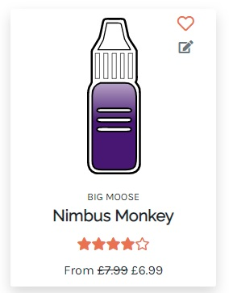
- Confirm the correct Brand is displayed for each product
    - CHECK
- Confirm that the correct star rating is displayed for each product and that "Not yet rated" is displayed for those without any reviews
    - CHECK
- Confirm the favourite heart icon is only shown when logged in as a Registered user
    - CHECK
- Confirm the edit icon is only shown when logged in as a Superuser
    - CHECK
- Click a heart icon to confirm it changes from empty to full and vice versa, and that doing so 
updates the database in the admin view
    - CHECK
- Click the edit icon to confirm it leads to the Edit Product page
    - CHECK

**Product Details Page**
- Confirm correct information about Product is displayed
    - CHECK
- Confirm no icons (heart, edit, trash) appear when not logged in
    - CHECK
- Confirm heart icon only displays when logged in as Registered user
    - CHECK
- Confirm on loading page that heart is only full if already a favourite
    - FAIL - it would always be full on joining the page, even though the subsequent clicks would correct it
    - issue was due to a previous mistake of removing the profile variable from the product detail and favourites views, meaning the template could not tell whether it was in the user's favourites list. Fixed by adding profile back into the contexts of the two views
    - the reason for this bug is not clear as the correct icon was being used initially
- Confirm clicking heart icon switches from empty to full and vice versa
    - CHECK
- When logged in as a superuser confirm clicking edit icon leads to the Edit Product page
    - CHECK
- Confirm clicking delete icon brings up modal asking for confirmation
    - CHECK
- Confirm clicking Delete removes the product from the database
    - CHECK

- Confirm the flavours (Tag model) of a product appear below it and are correct in the database
    - CHECK
- Confirm clicking on a flavour brings up other juices containing that same flavour
    - CHECK
- Confirm that the options available for a juice are represented correctly in the Add to Cart form
    - CHECK

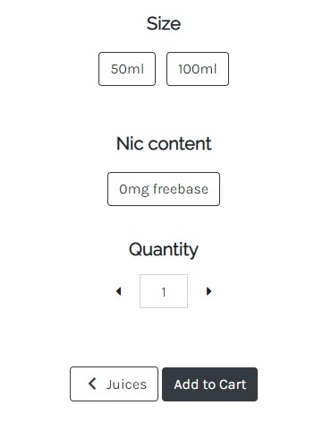
- Confirm that options are correctly attached to the product when it is added to the Cart
    - CHECK
- Confirm that users can update the quantity using the carets or by inputing into the text field
    - CHECK
- Confirm that the quantity entered cannot be less than 1 or more than 99, either using arrow keys, clicking the carets or entering the number manually
    - CHECK

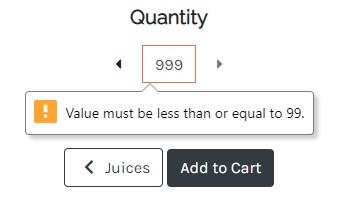
- Confirm that clicking the Juices button takes user back to all products view
    - CHECK
- Confirm that clicking the Add to Cart button does add the item to the cart
    - CHECK
- Confirm that if a product has no reivews, a message asking user to leave a review is displayed, and that clicking it will take them down the Reviews anchor
    - CHECK

**Reviews**

- Confirm that if a product has no reviews, a message is displayed about this with the request to Register/Login if user is not logged in
    - CHECK

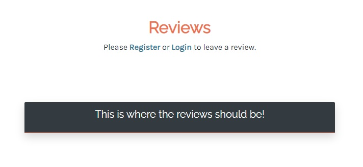
- Confirm that when logged in as Registered user, Review form is displayed
    -CHECK
- Confirm that after filling out the review and submitting, user is redirected back to the reviews section and can see their new review
    - CHECK
- Confirm that only if user has previously purchased the juice, they receive a toast notifcation telling them they have earned 5 points and their review has 'Verified Purchase on it'
    - CHECK

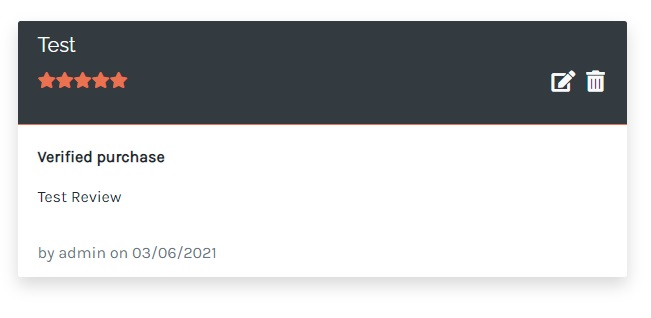
- Confirm that only review owner or Super user can see edit icon to edit their review
    - CHECK
- Confirm only admin can see the trashcan to delete a review
    - CHECK
- Confirm user can only review each juice once and they receive a message if they try to submit again
    - CHECK

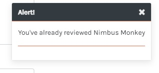
- Confirm 

**Cart**

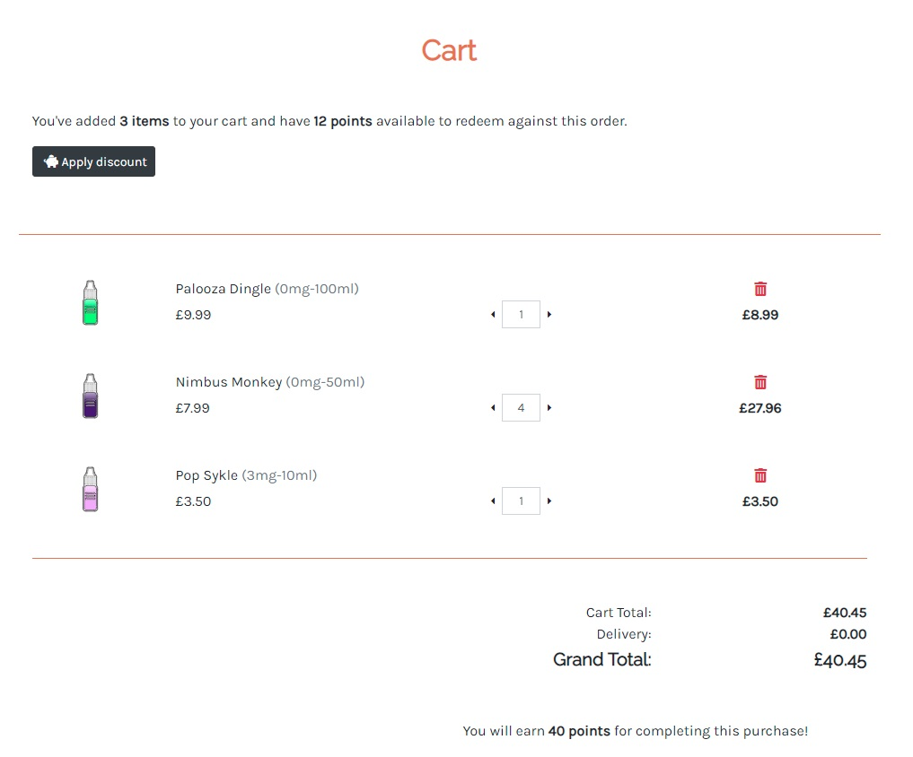
- Confirm that when there are no items in the shopping cart, visiting the Cart page displays a message saying "There's nothing here" and to "Come back when you've added something!"
    - CHECK
- Confirm adding items to cart when logged out, and then logging in, keeps the cart contents
    - CHECK
- Confirm correct number of profile points is displayed above cart contents
    - CHECK
- Confirm 'Apply discount' button and points tally is only visible when user has points
    - CHECK
- Confirm that the same product with different options will appear as a separate item when added to the Cart
    - CHECK
- Confirm quantities updated by page refresh when carets clicked
    - CHECK
- Confirm line items can be delted by clicking trash can
    - CHECK
- Confirm message informing user of how many points they could earn if they were registered/logged in
    - CHECK

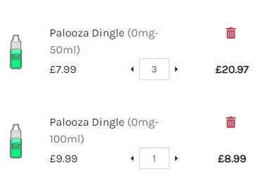
- Confirm that if a product was in the shopping cart before being deleted, a toast message appears informing the user that it has been removed from the cart
    - CHECK

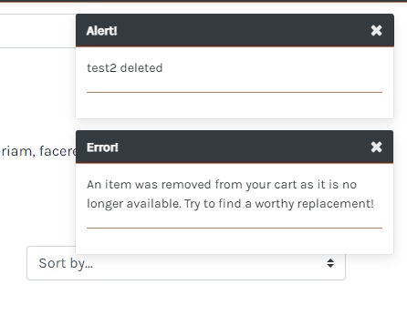
- Confirm logged in users can remove discount and page updates to show this
    - CHECK
- Confirm delivery delta is calculated correctly
    - CHECK
- Confirm delivery is £0 if £30 threshold reached
    - CHECK
- Confirm discount applied before delivery is added on
    - CHECK

**Checkout**
- Confirm correct items and amounts carried over from cart, including discount if applied
    - CHECK
- Confirm if user has logged in and saved their details previously, the form is pre-populated with them
    - CHECK
- Confirm Stripe webhooks successfully processed and Order saved
    - CHECK

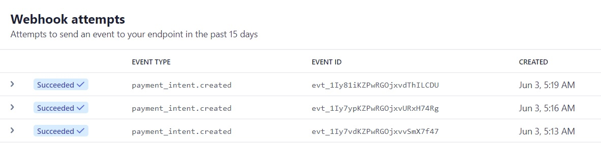

**Account Dashboard**
- Confirm correct points displayed above table
    - CHECK
- Confirm details can be updated and they prepopulate checkout form
    - CHECK
- Confirm all Orders displayed
    - CHECK
- Confirm can view individual orders via the link on order number
    - CHECK

- Confirm Reward history successfully updates and points awarded for Account creation, Reviewing verified purchase, points per pound spent
    - CHECK

**Add / Edit product**
- Confirm only admin can access pages
    - CHECK
- Confirm Name of Juice and colour update in real time
    - CHECK

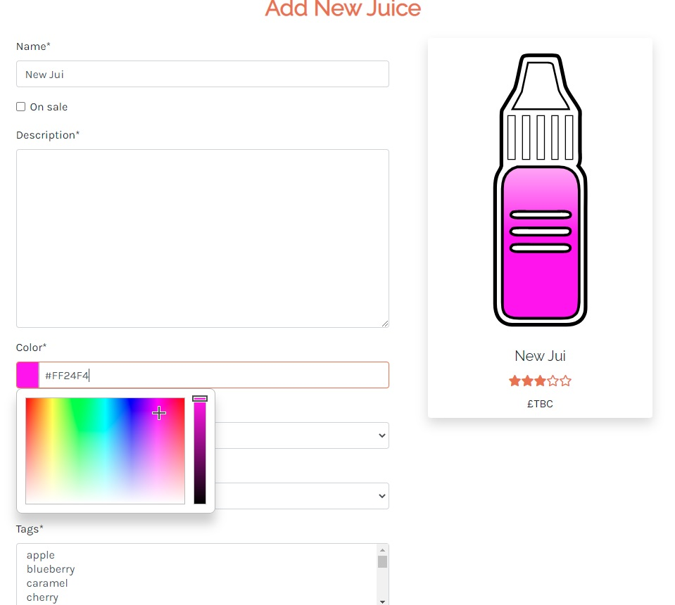
- Confirm added or updated juice reflected in database
    - CHECK

<a style="text-align:right" href="#top">Go to index :arrow_double_up:</a>

## Automated testing

Performance is generally good due to use of SVGs over images, however there are reported issues which relate to:
 - `render-blocking resources` due to Bootstrap and Font Awesome
 - `unused CSS` due to Bootstrap and Font Awesome
 - `unused JavaScript` due to Stripe and Jquery

Across the site all efforts have been made to provide screen-reader compatibility using aria-labels. However, there are issues relating to:
- `Heading elements are not in a sequentially-descending order`, some of which have not been remedied

[Chrome DevTools](https://developers.google.com/web/tools/chrome-devtools) - Lighthouse audit summary for both desktop and mobile:

**Home page**

- Performance: **99%**
- Accessibility: **100%**
- Best Practices: **100%**
- SEO: **100%**

**Product pages**

- Performance: **99%**
- Accessibility: **100%**
- Best Practices: **100%**
- SEO: **100%**

**Product details page**

- Performance: **98%**
- Accessibility: **99%**
- Best Practices: **100%**
- SEO: **90%**

**Cart page**

- Performance: **90 - 99%**
- Accessibility: **98%**
- Best Practices: **100%**
- SEO: **98 - 100%**

**Checkout page**

An issue relating to Stripe's `[aria-hidden="true"] elements contain focusable descendents` is present but has not been resolved.

- Performance: **89 - 99%**
- Accessibility: **97%**
- Best Practices: **100%**
- SEO: **100%**

**Add/edit juice page**

- Performance: **99 - 100%**
- Accessibility: **100%**
- Best Practices: **100%**
- SEO: **100%**

**Account dashboard page**

- Performance: **99 - 100%**
- Accessibility: **100%**
- Best Practices: **100%**
- SEO: **100%**

[W3C - HTML](https://validator.w3.org/) - 0 errors, 0 warnings - **PASS**

[W3C - CSS](https://jigsaw.w3.org/css-validator/) - 3 errors, 776 warnings:

`text-decoration-skip-ink doesn't exist : none`

`overflow-anchor doesn't exist : none`

Both were added by the CSS autoprefixer and do not appear to be causing any issues.

`backdrop-filter doesn't exist : blur(15px)`

This filter not have [universal support](https://caniuse.com/css-backdrop-filter) however in testing the hero image was still visible on devices without support, just without the fading blur effect. 

[Unicorn revealer - overflow](https://chrome.google.com/webstore/detail/unicorn-revealer/lmlkphhdlngaicolpmaakfmhplagoaln/related) - no evidence of overflow - **PASS**

[JS Hint](https://jshint.com/) - 0 errors, 0 warnings - **PASS**

[Pep8 Online](http://pep8online.com/) - 0 errors - **PASS**
Code from all `.py` files were pasted into pep8 online and all linting errors were fixed apart from:

- webhookhandler.py has two lines which could not be shortened without making the code illegible
- webhooks.py has one line which could not be shortened
- settings.py has two lines which could not be shortened

<a style="text-align:right" href="#top">Go to index :arrow_double_up:</a>

## Responsiveness

The site has been designed with a mobile-first philosophy and, supported by [Bootstrap](https://getbootstrap.com/), has been thoroughly tested at all stages of development using [Chrome DevTools](https://developers.google.com/web/tools/chrome-devtools).

In addition to Bootstrap's breakpoints, various media queries have been used to maximise the legibility of text and provide sufficient spacing for all content. These queries include optimised `margin`, `padding`, `text-align` and adjustments of `display` to accommodate changes in HTML structure. Particular attention has been paid to the appearance of cards and buttons on different devices.

<a style="text-align:right" href="#top">Go to index :arrow_double_up:</a>

### Browsers

Tested on:

- Chrome
    - no issues
- Edge
    - no issues
- Firefox
    - Hero image does not apply the blur filter on load but still displays fine
    - some input fields are larger than expected but overall nothing major
- Safari (iOS)
    - cannot use `background-attachment: fixed` as would cause the hero image not to load at all, but because it's a smaller screen this was easier to isolate with a media query and use `scroll` instead

### Screen sizes

Tested with Chrome DevTools using profiles for:

- Moto G4
- Galaxy S5
- Pixel 2
- Pixel 2 XL
- iPhone 5 SE
- iPhone 6/7/8
- iPhone 6/7/8 Plus
- iPhone X
- iPad
- iPad Pro

... and also using the responsive profiles of:

- Mobile S (320px)
- Mobile M (375px)
- Mobile L (425px)
- Tablet (768px)
- Laptop (1024px)
- Laptop L (1440px)

Real world testing on:

- iPhone 6S
- iPhone SE
- iPhone 11 Pro
- Asus ZenBook
- Dell XPS 7590

<a style="text-align:right" href="#top">Go to index :arrow_double_up:</a>

## Issues and bugs

### Resolved

- Bug 1: get_object_or_404 error caused by object id not being found
- Solution: find erroneous string iteration pointing to Nicotine (4 items) rather than Size (3 items)

- Bug 2: search queries via M2M relationship (Tags model) would return duplicate results
- Solution: using .distinct() on the filtered query

- Bug 5: custom save method on Review model used to request average_rating calculation on Product model. Rating was calculated before the new rating was saved meaning inaccurate ratings
- Solution: use a signal on Review creation/update/delete to call calculate_rating

- Bug 6: review save/delete signal would not fire as expected
- Solution: import the signal in the product/apps.py

- Bug 7: if product is deleted while exists in cart, 404 across all pages
- Solution (immediate): set cart contexts to equal 0 across the board and delete session cookies
- See below for more details

- Bug 8: signal to check whether user has already reviewed product when awarding points would always return true
- Solution: change from post_save to pre_save (as otherwise user will always have reviewed the product post save)

- Bug 9: signal to award points on Order post_save cannot retrieve the instance UserProfile
- Solution: this was due to 'if created' check only looking at the instance on the initial Order save, before the user's profile relationship was established. Fixed by switching 'if created' to 'if instance.user_profile'

- Bug 11: cannot get ::before pseudo class to work with certain font-awesome icons

`.icon-product:hover .far.fa-heart::before {
    content: "\F004";
}`

- Solution: adding font-family and font-weight to the pseudo class (https://stackoverflow.com/questions/47712987/font-awesome-5-on-pseudo-elements)

    `font-family: 'Font Awesome 5 Free';
    font-weight: 900;`

- Bug 12: sorting products by rating worked fine in mySQL but not in Postgres, appearing to order by nulls first
- Solution: using F function with nulls_last=True as argument in separate conditional for sortkey == 'average_rating'

- Bug 13: orders somtimes saved twice and have no grand total attached to them
- Solution: caused by webhook not being able to find order due to mismatching grand_total (following discount applied in cart). - Solved by checking discount_applied session at point of order_form save and including points_redeemed so that grand_total can be calculated properly

- Bug 14: static files not loading
- Solution: add STATIC_ROOT = os.path.join(BASE_DIR, 'staticfiles') to settings.py

- Bug 15: when moving inline scripts to respective static folders, one file (`remove-item.js`) could not be accessed.
- Solution: changed `STATICFILES_DIRS = (os.path.join(BASE_DIR, 'static'),)` to `STATICFILES_DIRS = [BASE_DIR/'static/']`

- Bug 16: orders saved in Production would have no cost associated with them
- Solution: this was particularly difficult to solve as the issue was only present in the deployed version. Extensive use of print statements showed that after the order was initially saved, the OrderLineItem signal to `update_total()` was not being fired. This (post)[https://stackoverflow.com/questions/66762262/django-signals-not-executed] led to checking the signal function name `update_on_save()` which, when changed, eliminated the error.

- Bug 17: rounding error for points earned on a purchase means user will occasionally get 1 point extra
- Solution: could not reproduce even with order_total ending £0.50 but set items to end £0.49 or £0.99 to mitigate issue

- Bug 18: messages.success includes cart contents no matter the context
- Solution: Partially solved by including context on rendered views (e.g. on_profile_page), however context cannot be passed on form submissions etc in the same way. Using a hidden form field is probably the best solution but in the meanwhile switched certain messages over from messages.success to the less cluttered messages.info

- Bug 20: deleting a product which has reviews leads to a KeyError
- Solution: caused by the signal which updates a product rating on deletion. On product deletion the CASCADE would delete all reviews, which would in turn fire the update_total signal for an instance which no longer existed. Solved initially by changing the signal to pre_delete, but this would have caused problems when updating the rating as it would include the to-be-deleted review too. Solve eventually by changing the ProductReview's on_delete to SET_NULL, storing the to-be-deleted reviews in the product's delete view,  deleting them after the product itself was deleted, and finally including a check that the product instance existed on the post_delete update signal.

### Unresolved

- Bug 3: line order items can be set to 0 in Admin

- Bug 19: deleting a product which has been purchased will obviously delete an order's lineitem and lead to problematic order histories.
Solution: insufficient time to fix, but likely using `on_delete=models.SET()` and retrieving string versions of the to-be-deleted product, siz, nicotine, price etc would be the way forward
UNSOLVED
- Bug 21: cart is not saved if a user logs out while items are in their cart.